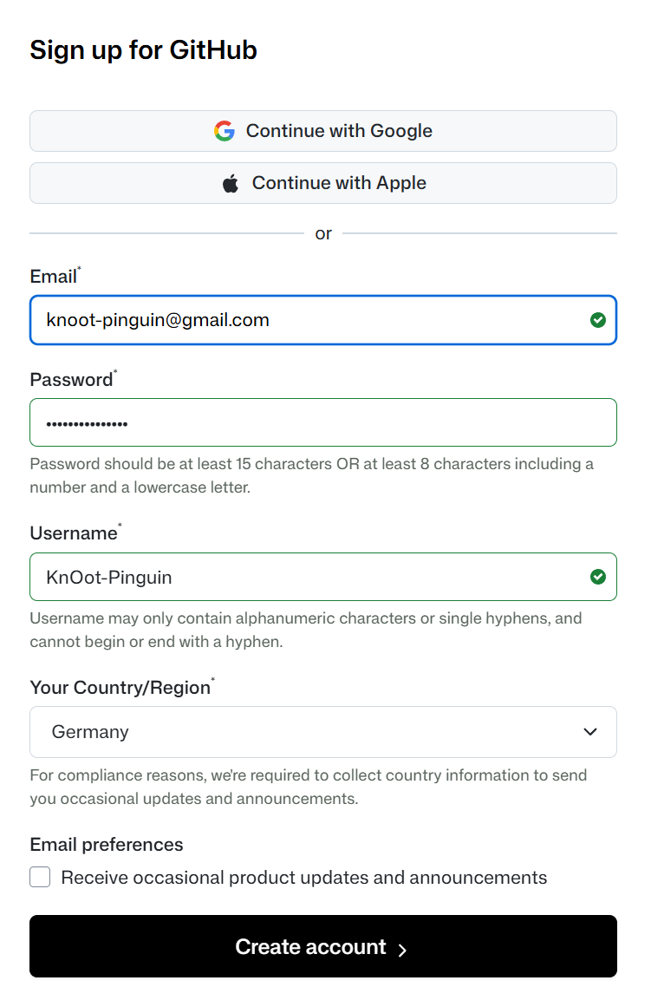
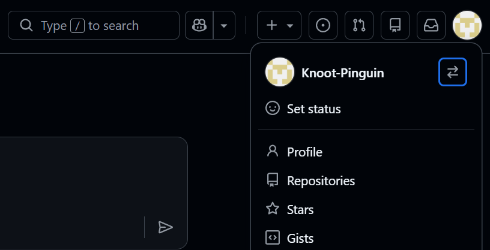

# Lektion 02: GitHub-Erste Schritte

## Ziel

Du hast einen GitHub-Account erstellt und lernst das Tool zunächst im Browser kennen.

## Kapitel 1: Was ist GitHub?

GitHub ist eine Plattform im Web, auf der du Code speichern, versionieren und teilen kannst.

### Warum GitHub?

Wir bereiten uns darauf vor, mit KI Code zu produzieren. Und auch wenn du sehr gute Prompts schreibst: KI kann dich missverstehen und deinen Code falsch verändern.
Deshalb nutzen wir Git als Versionskontrolle. Git speichert Versionen deiner Arbeit, damit du bei Bedarf jederzeit auf einen früheren Stand zurückgehen kannst. GitHub baut auf Git auf und macht Repositories übersichtlicher. Außerdem wird die Zusammenarbeit an Code deutlich einfacher.

### Warum brauchen wir GitHub im Kurs?

Im Kurs dreht sich vieles darum, wie echte Softwareentwicklung heute aussieht. Und dazu gehört GitHub von Anfang an. Hier ist, warum du es brauchst:

**Dein eigenes Übungs-Repository**
Du legst auf GitHub dein persönliches Repository an. Dort speicherst du alle deine Übungen, Lösungen und Notizen. Niemand sonst kann dort schreiben, es gehört dir.

**Das gemeinsame Kurs-Repository**
Der Kurs selbst liegt ebenfalls auf GitHub. Alle Aufgaben, Materialien und Updates kommen von dort. Du lernst, wie du Änderungen aus dem Kurs-Repo holst und mit deiner eigenen Arbeit kombinierst, genau wie in echten Projekten.

**Feedback und Zusammenarbeit**
Dozierende können deine Commits sehen und dir direkt am Code Rückmeldung geben. Das ist kein bürokratischer Schritt, sondern echte Praxis: So lernst du, wie Code-Review funktioniert.

**GitHub Copilot**
Ein zentrales Werkzeug im Kurs ist GitHub Copilot. Es ist direkt in VS Code integriert und setzt einen GitHub-Account voraus. Ohne Account kein Copilot.

**Dein Einstieg in echte Entwicklungspraxis**
GitHub zu nutzen bedeutet, von Tag 1 so zu arbeiten, wie Entwickler:innen es weltweit tun. Was du hier lernst, gilt genauso im nächsten Praktikum, im Job oder im eigenen Projekt.

GitHub ist im Basistarif kostenlos. Du brauchst nur einen Account.

## Kapitel 2: Account erstellen

### Schritt-für-Schritt: GitHub-Account anlegen

1. Öffne die Seite https://github.com.
2. Klicke oben rechts auf **Sign up**.
3. Falls **Sign up** nicht sichtbar ist: Öffne direkt https://github.com/join.

Ab hier hast du zwei Varianten zur Registrierung. Wähle genau eine:

**Variante A: Registrierung per E-Mail**

4. Trage deine E-Mail-Adresse ein.
5. Erstelle ein sicheres Passwort.
6. Wähle einen Benutzernamen.
7. Folge den angezeigten Schritten.

**Variante B: Registrierung per SSO (z. B. Google oder Apple)**

4. Wähle auf der Registrierungsseite die SSO-Option deines Anbieters.
5. Melde dich beim gewählten Anbieter an und bestätige die Freigabe für GitHub.
6. Ergänze fehlende Angaben wie Benutzernamen, falls GitHub danach fragt.

Hinweis: Für Accounts, die du nach dem Kurs weiter nutzt, sind beide Varianten möglich. E-Mail und SSO unterscheiden sich vor allem in deiner persönlichen Präferenz und der gewünschten Login-Methode.

### Falls etwas nicht funktioniert

1. Keine Bestätigungs-E-Mail angekommen:
	Prüfe den Spam-Ordner und fordere die E-Mail erneut an.
2. Benutzername ist schon vergeben:
	Wähle eine Variante mit Zusatz (z. B. Zahl oder Bindestrich).
3. Verifizierung klappt nicht:
	Aktualisiere die Seite und starte den Verifizierungsschritt neu.
4. Sign-up-Seite lädt nicht:
	Öffne ein privates Browserfenster oder nutze einen anderen Browser.

### Mini-Check nach der Registrierung

- [ ] Ich kann mich mit meinem GitHub-Account einloggen.
- [ ] Ich sehe mein Profilsymbol oben rechts.
- [ ] Ich habe Zugriff auf mein Profil unter https://github.com/<mein-benutzername>.

<!-- Screenshot-Platzhalter GH-05: Geöffnetes GitHub-Profil mit sichtbarer Profil-URL im Browser (https://github.com/<mein-benutzername>). -->

### Hinweise

- Der GitHub-Benutzername ist sichtbar.
- Wenn du den Account nach dem Kurs weiter nutzen möchtest, verwende am besten einen eigenen, dauerhaft verfügbaren Account statt des temporären Account von KnOot.
- Wähle einen Benutzernamen, den du auch später im Kurskontext verwenden möchtest.
- Nutze einen Passwortmanager im Browser oder auf deinem Gerät, damit du dein Passwort sicher speichern kannst.
- Hilfe beim Einrichten deines Profils: [GitHub Docs - Dein Profil einrichten](https://docs.github.com/de/get-started/start-your-journey/setting-up-your-profile)

## GitHub unterstützt dich mit vielen Ressourcen

GitHub bietet umfangreiche Unterstützung und Lernmöglichkeiten:

- **Offizielle Dokumentation**: Alles, was du über GitHub wissen musst, steht in den [GitHub Docs](https://docs.github.com/de) (auf Deutsch verfügbar, durchsuchbar und sehr gut strukturiert). Ein zuverlässiger Nachschlageort für den gesamten Kurs.
- **Support und Community**: Auf [support.github.com](https://support.github.com/) findest du Artikel zu häufigen Problemen, einen direkten Support-Kanal und die GitHub Community, in der du Fragen stellen und Antworten von anderen Nutzer:innen finden kannst.
- **Lernen und Zertifizierungen**: GitHub bietet eigene Kurse an. Auf [learn.github.com/courses](https://learn.github.com/courses) und [learn.github.com/skills](https://learn.github.com/skills) kannst du gezielt Themen vertiefen und anerkannte GitHub-Zertifizierungen erwerben.
- **Video-Playlist für den Einstieg**: YouTube-Playlist [GitHub for Beginners](https://www.youtube.com/watch?v=r8jQ9hVA2qs&list=PL0lo9MOBetEFcp4SCWinBdpml9B2U25-f).

## Quiz: Kurze Verständnisfrage

Frage: Wozu dient GitHub im Kurs hauptsächlich?

- [ ] Als E-Mail-Dienst für Nachrichten an Dozent*innen.
- [x] Als Plattform zum Speichern und Teilen von Code mit Versionsverlauf.
- [ ] Als Video-Lernplattform für Kursinhalte.
- [ ] Als lokales Programm auf deinem Rechner, das nur offline funktioniert.

Erfolg: Richtig! GitHub ist deine Plattform für Code und Zusammenarbeit im Kurs.
Fehler: Nicht ganz. Merke: GitHub ist die Plattform im Web, Git ist das Werkzeug für Versionskontrolle.
