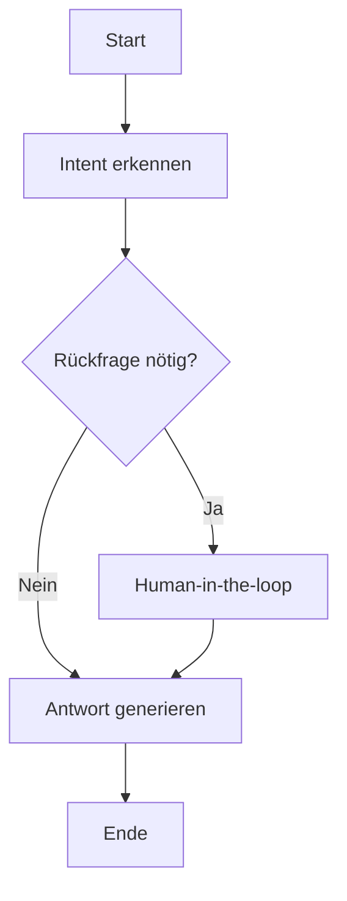

# Lektion 03: LangGraph Kernkomponenten und Workflows

## Ziel

Du verstehst die Kernbausteine von LangGraph (Nodes, Edges, State) und kannst erklären, warum sich graphbasierte Workflows besonders für komplexe, zustandsbehaftete AI-Agents eignen.

## Kapitel 1: Was LangGraph ist

LangGraph ist ein Framework im LangChain-Umfeld für zustandsbehaftete Multi-Agent-Anwendungen.

Der Fokus liegt auf Kontrolle und Flexibilität:

- eher low-level statt starrer Abkürzungen
- klare Steuerung von Ablauf und Zustand
- gut geeignet für komplexe Agentenlogik

## Kapitel 2: Die drei Grundbausteine

### Nodes

Nodes sind die Arbeitsschritte im Workflow. In einem Node passiert die eigentliche Verarbeitung, zum Beispiel:

- Anfrage klassifizieren
- Informationen abrufen
- Antwort erzeugen
- Ergebnis prüfen

### Edges

Edges definieren die Übergänge zwischen Nodes.

Sie legen fest, wie der Ablauf weitergeht:

- linear zum nächsten Schritt
- verzweigt je nach Bedingung
- zurück in eine Schleife

### State

State ist der gemeinsame Speicher für den Workflow.

Dort liegen Kontext und Zwischenergebnisse, damit der Ablauf nicht bei jedem Node bei null startet.

## Kapitel 3: Zentrale Fähigkeiten von LangGraph

### Schleifen und Verzweigungen

Workflows können dynamisch reagieren:

- wiederholen, bis ein Kriterium erfüllt ist
- alternative Pfade bei unterschiedlichen Situationen

### Persistenter Zustand

Kontext bleibt über längere Interaktionen erhalten.

Das ist wichtig für Agenten, die über mehrere Schritte oder Gespräche konsistent bleiben müssen.

### Human-in-the-loop

An kritischen Stellen kann ein Mensch eingreifen:

- Freigabe geben
- Entscheidung korrigieren
- zusätzliche Informationen liefern

### Time Travel für Debugging

Du kannst frühere Zustände wiederherstellen, um Fehlerursachen nachvollziehbar zu analysieren.

## Kapitel 4: Warum nicht nur if/while?

Klassische Kontrollstrukturen sind für einfache Abläufe gut, aber bei komplexen Agentensystemen schnell unübersichtlich.

LangGraph bietet dafür mehrere Vorteile:

1. explizites State-Management
: Kontext wird sauber über den gesamten Ablauf geführt.

2. bedingte Übergänge zur Laufzeit
: Entscheidungen können dynamisch getroffen werden.

3. modulare Bausteine
: Nodes lassen sich einzeln entwickeln und testen.

4. bessere Beobachtbarkeit
: Der Ablaufpfad ist transparent und damit leichter zu debuggen.

## Kapitel 5: Praxisbeispiel Kundenservice-Agent

Ein einfacher Loop kann Eingaben wiederholt abfragen, verliert aber oft wichtigen Gesprächskontext.

Ein LangGraph-Workflow kann dagegen:

- den Falltyp erkennen
- je nach Typ in passende Bearbeitungspfade verzweigen
- bei Unsicherheit menschliche Freigabe einholen
- danach im selben Kontext weiterarbeiten

So entsteht ein robuster, nachvollziehbarer Serviceablauf statt einer linearen Einzelschleife.

## Kapitel 6: Visualisierung mit Mermaid

LangGraph-Abläufe lassen sich als Mermaid-Diagramm darstellen.

Das hilft bei:

- Architekturgesprächen im Team
- schneller Orientierung in komplexen Abläufen
- Fehleranalyse entlang der tatsächlichen Pfade

Mini-Beispiel:

## Quiz: Vertiefung zu LangGraph

### Frage 1

Frage: Welche Aussage beschreibt die Rolle von State in LangGraph am besten?
Hinweis: Wähle die treffendste Aussage.
Mehrfachauswahl: nein

- [ ] State enthält nur die finale Antwort eines Workflows.
- [x] State speichert Kontext und Zwischenergebnisse, damit Nodes aufeinander aufbauen können.
- [ ] State wird nur für Visualisierungen in Mermaid verwendet.
- [ ] State ersetzt vollständig die Notwendigkeit von Edges.

Erfolg: Genau. State hält den Ablaufkontext über mehrere Nodes hinweg stabil.
Fehler: Achte auf den Kern: State ist gemeinsamer Kontextspeicher, nicht nur Endergebnis.

### Frage 2

Frage: Welcher Vorteil von LangGraph ist für komplexe Agenten-Workflows besonders wichtig?
Hinweis: Wähle die treffendste Aussage.
Mehrfachauswahl: nein

- [ ] Es verhindert grundsätzlich jede Halluzination.
- [ ] Es ersetzt die Notwendigkeit von menschlicher Freigabe.
- [x] Es kombiniert bedingte Übergänge, Schleifen und persistentes State-Management in einer klaren Workflow-Struktur.
- [ ] Es funktioniert nur ohne externe Tools.

Erfolg: Richtig. Gerade die Kombination aus Ablauflogik und Zustand macht LangGraph stark.
Fehler: LangGraph verbessert Struktur und Steuerung, löst aber nicht automatisch alle Qualitätsprobleme.

### Frage 3

Frage: Was bringt die Mermaid-Visualisierung in LangGraph-Projekten konkret?
Hinweis: Wähle die treffendste Aussage.
Mehrfachauswahl: nein

- [ ] Sie dient nur dazu, den Code schöner aussehen zu lassen.
- [x] Sie macht Pfade, Verzweigungen und Übergänge sichtbar und unterstützt Verständnis sowie Debugging.
- [ ] Sie ersetzt Tests und Monitoring vollständig.
- [ ] Sie ist nur bei sehr kleinen Workflows sinnvoll.

Erfolg: Genau. Visualisierung verbessert Transparenz und Teamkommunikation.
Fehler: Diagramme sind ein starkes Diagnosewerkzeug, aber kein Ersatz für Tests.

## Fallback

- Workflow wirkt zu komplex: zuerst nur Start, Entscheidung, Ende modellieren.
- State wird unübersichtlich: klare Schlüssel für Eingaben, Zwischenergebnisse und Entscheidungen verwenden.
- Zu viele Sonderfälle: zuerst Hauptpfad stabil machen, danach Randfälle ergänzen.

## Erfolgskriterium

Du kannst einen einfachen LangGraph-Workflow mit Nodes, Edges und State skizzieren und begründen, an welcher Stelle Verzweigung, menschliche Freigabe und Persistenz nötig sind.

## Was ist zu tun

1. Skizziere einen Mini-Workflow mit mindestens 4 Nodes.
2. Markiere eine Verzweigung und einen Rücksprung.
3. Definiere, welche Informationen im State gehalten werden.
4. Ergänze eine Stelle für Human-in-the-loop.

## Hilfreiche Links

- [Lektion 01: Generative KI vs. agentische KI](./01-generative-vs-agentic-ai.md)
- [Lektion 02: Von AI Agents zu Agentic AI](./02-von-ai-agents-zu-agentic-ai.md)
- [Prompt-Dateien Grundlagen](../../03-course-library/06-ai-instructions/03-prompt-dateien-grundlagen.md)
